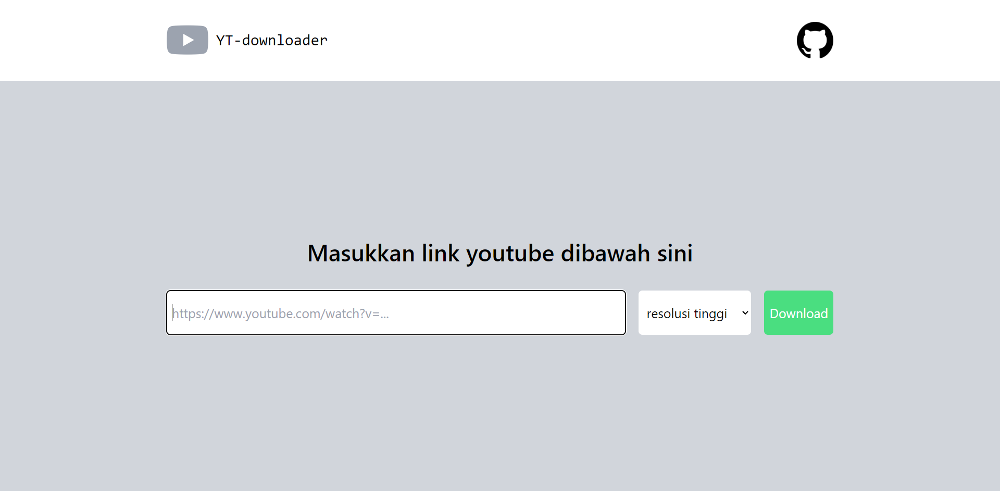

<p align="center"><strong>YT-downloader | install video youtube</strong></p>
<p align="center"><sub>express tailwindcss <a href="https://github.com/fent/node-ytdl-core">ytdl-core</sub></p>
<p align="center"><sub>Jangan lupa tekan 🌟</sub></p>

## Langkah untuk menggunakan YT-downloader

1. ```git clone https://github.com/insanXYZ/YT-downloader.git```
2. ```cd YT-downloader```
3. ```npm install```
4. ```npm run start```
5. buka ```localhost:3000``` di browser

## Catatan

untuk saat ini YT-downloader hanya mendukung untuk mengunduh dengan format ***video/mp4***, tunggu untuk update selanjutnya dengan dukungan format audio/mp3